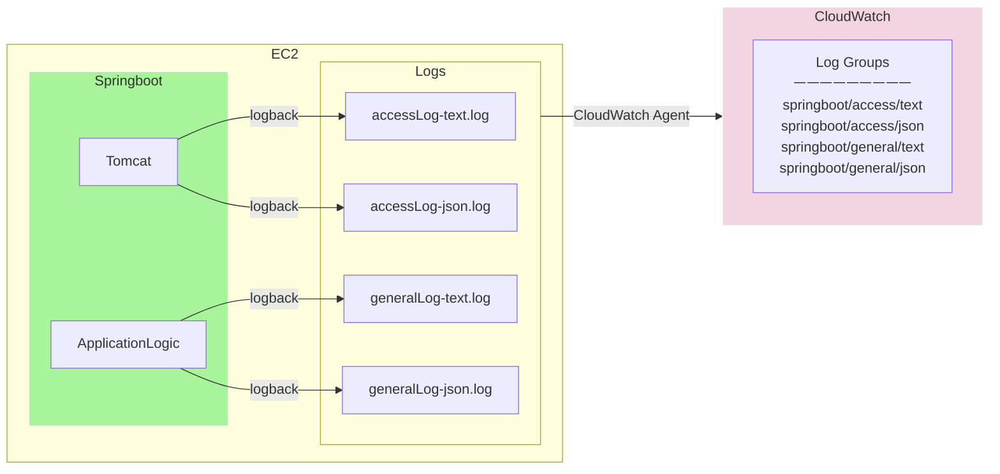

## 프로젝트 소개
- 개발자 커뮤니티 & 소프트웨어 커리큘럼 Aggregator 웹 서비스

 

## 주요 기능

 

## 기술 스택
- Java 17, TypeScript 4.8.4
- Spring Boot 3.1.4, React 18.2.0, MariaDB 10.5.20
- AWS CodeDeploy, CloudFront, EC2, S3, Secrets Manager

 

## 인프라

  
운영환경 아키텍처

  

  
스테이징 환경 아키텍처

  

  
로컬 개발 환경 아키텍처

  

  
프론트엔드 CI/CD

  

  
백엔드 CI/CD

  

### CloudWatch 모니터링

## API 문서

- https://api.bootme.co.kr/docs/swagger/index.html
- https://api.bootme.co.kr/docs/rest/index.html

 
